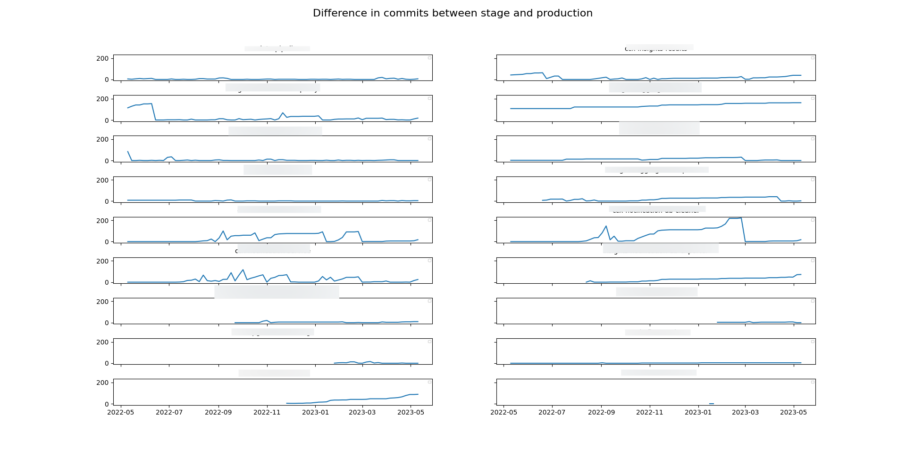

# App Interface Lag Checker

Download any `deploy.yml` file from app-interface like 
[ccx-data-pipeline/deploy.yml](https://gitlab.cee.redhat.com/service/app-interface/-/blob/master/data/services/insights/ccx-data-pipeline/deploy.yml)
and run

```
INPUT_FILE=deploy.yml python main.py > results.csv
```

You can optionally use the `N_DAYS` env variable to checkout the repos at 
`N_DAYS` back. This way you can build historical charts. See 
[get_historical_data.sh](get_historical_data.sh) and [ploter.py](ploter.py). 
An example:


